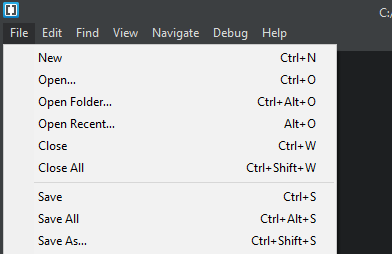
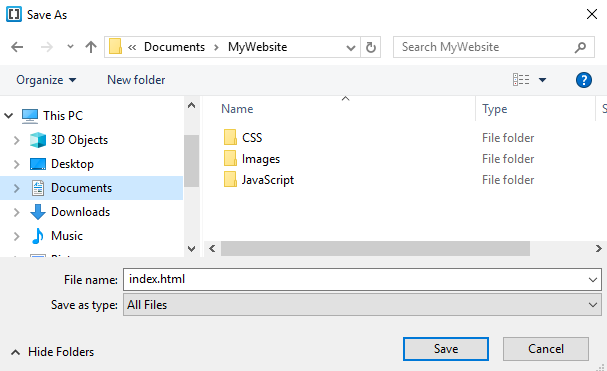
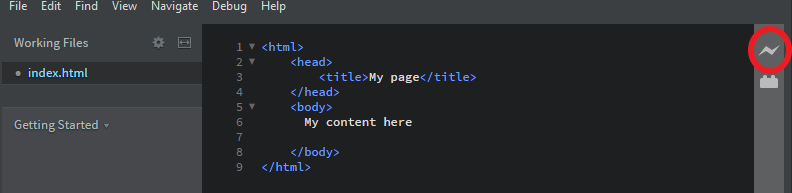

## Working offline with HTML, CSS and Javascript

Text editor
Creating boilerplate files
Mention files should be in the same directory
Saving files
Viewing using browser

We recommend using the program `Brackets` by Adobe to write your HTML, CSS and Javascript code offline. If you can't install Brackets, for example on a Raspberry Pi, you can use other text editors like Geany. See below for instructions on setting up and writing using these tools.

--- collapse ---
---
title: I'm using Windows, Mac or Linux desktop or laptop
---
+ Download and install Brackets [here](http://brackets.io/)

+ After Brackets is installed, open the program and go to `File -> New` to open a new file. 


+ Then go to `File -> Save As`, use the name `index.html` and navigate to the folder that you want to save your work. Finally click `Save`.


----------
It is good practice to keep your files organised, a common folder structure might look like this:

```
MyWebsite
 |
 +-- index.html
 |
 +-- CSS
 |    |
 |    +-- stylesheet.css
 |
 +-- Images
 |    |
 |    +-- image.jpg
 |
 +-- Javascript
      |
      +-- script.js
```
Here we have a folder called `MyWebsite`, inside we have our new index.html file and 3 more folders for CSS files, Image files and JavaScript files.
-----------
+ The HTML code below gives you the basic structure of a page. Copy and paste it into the file you created, then save the file. Keep the text editor open so you can edit the file.
```html
<html>
    <head>
        <title>My page</title>
    </head>
    <body>
        My content here
    </body>
</html>
```
+ To view your webpage in brackets, ensure that the Google Chrome browser is installed on your machine and click on the lightning symbol. 




This will open your webpage in a seperate window. When you make a change and click `File -> Save`, your webpage should automatically update too!

--- /collapse ---

--- collapse ---
---
title: I'm using a Raspberry Pi
---


--- /collapse ---